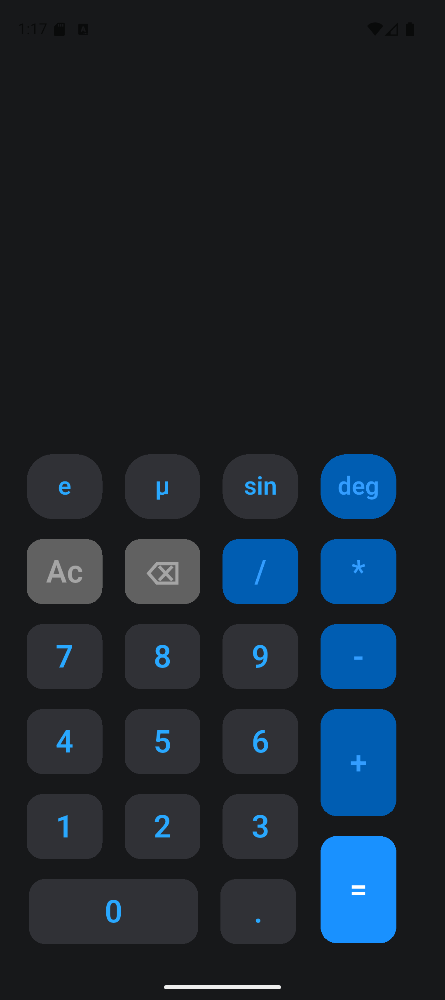
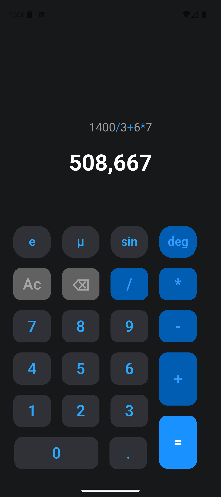
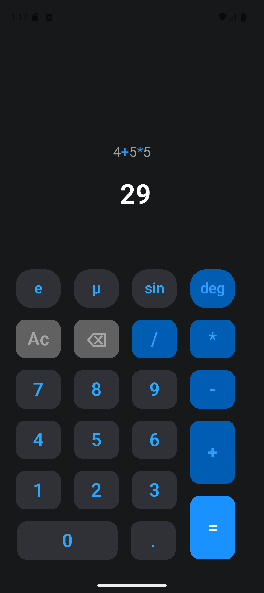

# 📱 Calculator App (Flutter)

A simple and modern calculator mobile app built using Flutter. It supports basic arithmetic operations with a clean UI and responsive design.

---

## ✨ Features

- Basic operations (+ − × ÷)
- Scientific buttons (sin, μ, deg… UI only)
- Real-time expression display
- Formatted result (rounded to 3 decimals)
- Removes unnecessary .0 for integers
- Clean modern UI
- Custom reusable widgets
- Responsive design support

---

## 🖼️ Screenshots

<p align="center">
  
  
  
</p>

---

## 🧠 Tech Stack

- Flutter
- Dart
- math_expressions (for calculations)
- flutter_svg

---

## 📂 Project Structure
lib/
│
├── core/
│ ├── color/
│ └── responsive/
│
├── feature/
│ ├── widget/
│ │ ├── custom_container.dart
│ │ └── custom_sized_box.dart
│ │
│ └── screen/
│ └── calc.dart
│
└── main.dart


---

## 🚀 Getting Started

### 1. Clone the repo

```bash
git clone https://github.com/your-username/calculatior.git
``` 
### 2. Install dependencies

```bash
flutter pub get
``` 
### 3. Run the app

```bash
flutter run
``` 
### 📦 Dependencies

```bash
flutter_svg: ^2.0.10+1
math_expressions: ^2.6.0
cupertino_icons: ^1.0.8
``` 